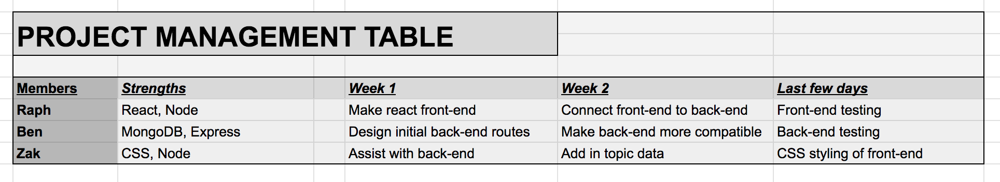
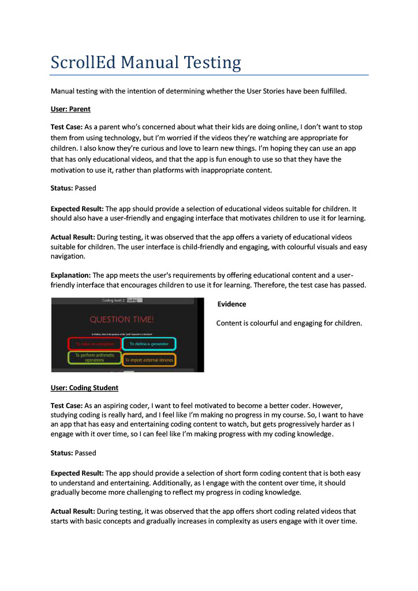

# T3A2 WEB APP ASSIGNEMENT 

## Group Members
- Raphael Florea
- Zak Mohamed
- Benjamin Phillips

## Important links

### [Deployed website](https://t3-a2-frontend-azm4-6mbobk88m-ausraf720.vercel.app/)

#### Github links

[Front-end repository](https://github.com/ausraf720/T3A2-frontend)

[Back-end repository](https://github.com/BenPhillips-21/T3A2-B/)

#### Project Management links

[Project management and Trello board screenshots](#project-management-table)

[Trello board link](https://trello.com/b/6VMUl8Tx/t3a2-full-stack-app)

[Manual Testing for production site](#manual-testing)

## INSTRUCTIONS

1. Firstly, when starting the website, it can take some time to load. Wait at least 2 minutes.

2. Then you'll be greeted with the login/signup page, where you can choose to login or signup and enter your details.

3. If you sign up with a new user as seen below, you'll automatically be logged in with that user.

4. Then you'll be greeted with the main page. Here you can choose between topics, and use the arrows to go between videos. On the bottom of the page is a logout option that takes you back to the login/signup screen.

5. Finally you'll reach the questions screen after clicking on the right arrow enough times. If you get the question right on that topic, you level up for that topic and the content gets more difficult. Your level will be saved, so if you log out and log back in again, it will be the same as before.

6. If you get the question wrong, you won't level up.

## Description of web application

### Purpose

The purpose of this project is to make an app that combines the addictiveness of short-form content with education. Youths of modern times spend lots of time scrolling through short-form videos on platforms such as Tik Tok and Youtube Shorts. During this time, they’re not productive at all, effectively wasting up to hours of their day not accomplishing anything due to the content being so addictive.

The app will still have the same short-form content, but it will only be educational and also have a mix of videos with some multiple-choice questions. These questions that show up from time to time will encourage the user to remember facts about the content they just watched, as they will be about the topics of those videos. If users can get questions right a lot for a particular topic, they can ‘level’ up for that topic, get more difficult videos and related questions, and be able to upgrade their account.

Because this app still only has short-form content, it should still remain addictive, but using it won’t be a complete waste of time as its users will be encouraged to remember facts to get the occasional multiple-choice question correct. They’ll be motivated to do so as if they can get questions correct, they’ll progress to more difficult videos from that same topic, but also get potential prizes for getting to higher topic difficulties such as being able to customise their profile. Thus, users will be able to walk away from using this app after long periods of time having memorised some facts and useful information, and not having completely wasted their time.

### Functionality

This app will mostly be a platform for short-form content like the above two mentioned, so its main function will be to have a constant stream of short videos that a user will be able to scroll through, much in the same way that can be done on Tik Tok and Youtube Shorts. As mentioned previously, it will only have educational videos. Each video will be part of a topic, such as geography, Python coding, history of the industrial revolution, etc. 
After every 5 videos, with each video coming from any topic, a single multiple choice question pops up. Users only get one attempt at this question, and it will be about a topic from one of the past 5 videos. If users manage to get enough right answers for a given topic, for instance get the last 4 out of the 5 questions correct for a given topic, then their ‘level’ for that topic will increase. As an example, if in a day they go through 5 multiple-choice questions about flags of different countries, and manage to correctly identify 4 flags correctly, they will go from ‘Level 1’ to ‘Level 2’ on geography. Now the videos and related questions will be more difficult, this time asking about capital cities of various countries.

## Target Audience

The target will be kids and younger adults who have access to technology, many of whom often find themselves spending up to hours scrolling through short-form content while not being productive at all. As this is the group that tends to stay hooked on short form content for a long time, it only seems natural that they should also stay hooked to this particular app as well.

## Tech Stack

This software will feature the MERN stack, and also utilise links to Youtube shorts (for testing purposes). 

**MongoDB** will be used to store both data on users, their points/statistics, data on all the videos that will show up in the app, and also questions for each video topic. The videos for this demonstration will be educational videos from Youtube shorts from a variety of Youtube channels that provide free and public educational videos.

**Express** will be used to obtain data from the database to be given to the front-end of the app. Likewise, it will also be used to update data in the MongoDB database. **Mongoose** will also be important for providing schemas for the database.

**React** will be used to display the videos to the user, and also the multiple choice questions based on the data collected and calculations made, as will as the sign-in/sign-up pages. React will then be able to pass information from the user when they answer the multiple choice questions.

**Node** will be essential for doing calculations regarding each user, and also randomly picking out videos as well as questions for the videos. It will be used to determine what videos from what topics should be displayed, based on the questions the user was able to get correct.

## Dataflow Diagrams

## Application Architecture Diagram

## User Stories

## Wireframes

## Project Management Table

## Trello Screenshots

Complete part A of assignment

Assign tasks, make project management schedule, then complete part B

Finish up with front-end and back-end functionality, then focus on connecting them together

Do styling, fix any existing issues, and conduct tests

## Manual testing

